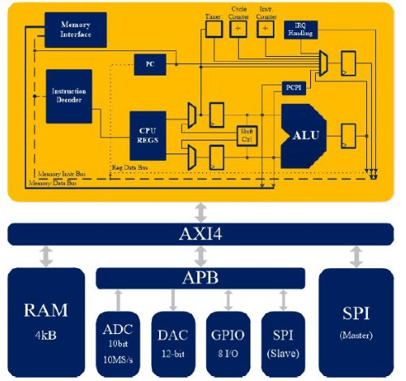

# mriscv

Building a pure RV32I Toolchain
-------------------------------

The default settings in the [riscv-tools](https://github.com/riscv/riscv-tools) build
scripts will build a compiler, assembler and linker that can target any RISC-V ISA,
but the libraries are built for RV32G and RV64G targets. Follow the instructions
below to build a complete toolchain (including libraries) that target a pure RV32I
CPU.

The following commands will build the RISC-V gnu toolchain and libraries for a
pure RV32I target, and install it in `/opt/riscv32i`:

    # Ubuntu packages needed:
    sudo apt-get install autoconf automake autotools-dev curl libmpc-dev libmpfr-dev \
            libgmp-dev gawk build-essential bison flex texinfo gperf libtool patchutils bc

    sudo mkdir /opt/riscv32i
    sudo chown $USER /opt/riscv32i

    git clone https://github.com/riscv/riscv-gnu-toolchain riscv-gnu-toolchain-rv32i
    cd riscv-gnu-toolchain-rv32i
    git checkout 7e48594
    git submodule update --init --recursive

    mkdir build; cd build
    ../configure --with-arch=RV32I --prefix=/opt/riscv32i
    make -j$(nproc)

The Microcontroller
-------------------

The microcontroller is composed by a 32b RISC-V core, a 4KB SRAM, a 10b ADC, a 12b DAC, 8 GPIO, and two SPI interfaces (master and slave). All the modules are conneted using two differente buses: AXI4 and APB.

The directory tree is:

mriscv/mriscv_axi/ADC_interface_AXI     -----> ADC interface with the AXI4 bus

mriscv/mriscv_axi/AXI_SP32B1024         -----> SRAM memory interface

mriscv/mriscv_axi/DAC_interface_AXI     -----> DAC interface with the AXI4 bus

mriscv/mriscv_axi/axi4_interconnect     -----> the AXI4 bus

mriscv/mriscv_axi/impl_axi              -----> the microcontroller

mriscv/mriscv_axi/spi_axi_master        -----> master SPI used for programming

mriscv/mriscv_axi/spi_axi_slave         -----> slave SPI used for data adquisition

Development Board
-----------------

Also, there are a PCB design for the development board, including circuits for sensing analog signals and the capability to use  external clocks. The design is in mriscv/board

